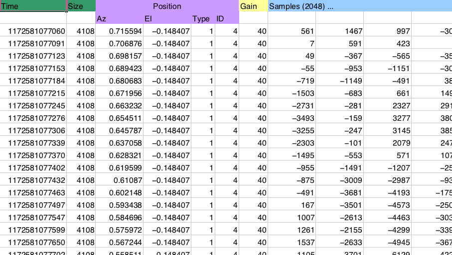
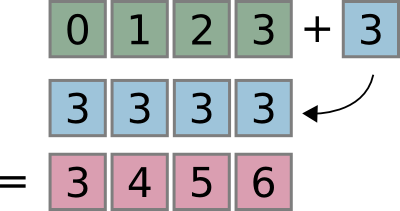
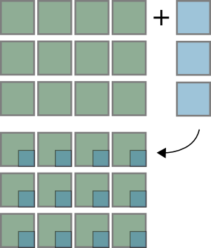
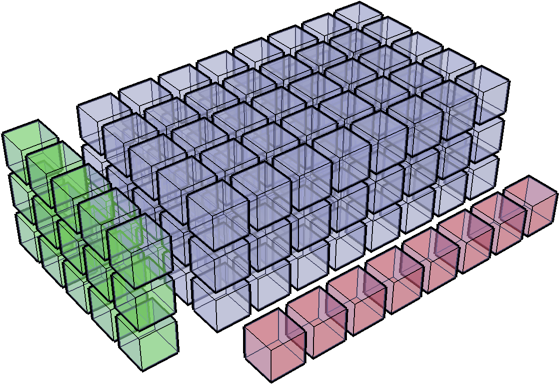

.left-column[
  ## The NumPy ndarray
]

.right-column[

### Revision: Structure of an array


Taking a look at ``numpy/core/include/numpy/ndarraytypes.h``:

```
ndarray typedef struct PyArrayObject {
    PyObject_HEAD
    char *data;             /* pointer to data buffer */
    int nd;                 /* number of dimensions */
    npy_intp *dimensions;   /* size in each dimension */
    npy_intp *strides;      /* bytes to jump to get
                             * to the next element in
                             * each dimension
                             */
    PyObject *base;         /* Pointer to original array
                            /* Decref this object */
                            /* upon deletion. */
    PyArray_Descr *descr;   /* Pointer to type struct */
    int flags;              /* Flags */
    PyObject *weakreflist;  /* For weakreferences */
} PyArrayObject ;
```

]

---

## A homogeneous container

```
char *data;  /* pointer to data buffer */
```

Data is just a pointer to bytes in memory:

```
In [16]: x = np.array([1, 2, 3])

In [22]: x.dtype
Out [22]: dtype('int32') # 4 bytes

In [18]: x.__array_interface__['data']
Out [18]: (26316624, False)

In [21]: str(x.data)
Out [21]: '\x01\x00\x00\x00\x02\x00\x00\x00\x03\x00\x00\x00'
```

---

## Dimensions

```cpp
int nd;
npy_intp *dimensions; /* number of dimensions */
                      /* size in each dimension */
```

```python
In [3]: x = np.array([])
In [4]: x.shape
Out [4]: (0,)

In [5]: np.array(0).shape
Out [5]: ()

In [8]: x = np.random.random((3, 2, 3, 3))
In [9]: x.shape

Out [9]: (3, 2, 3, 3)
In [10]: x.ndim

Out [10]: 4
```

---

.up20[.up30[

### Data type descriptors

```
PyArray_Descr * descr ;  /* Pointer to type struct */
```

Common types in include ``int``, ``float``, ``bool``:
```
In [19]: np.array ([-1, 0, 1], dtype=int)
Out [19]: array([-1, 0, 1])

In [20]: np.array([-1, 0, 1], dtype=float)
Out [20]: array ([-1., 0., 1.])

In [21]: np.array([-1 , 0, 1], dtype=bool)
Out [21]: array([True, False, True], dtype=bool)
```
Each item in the array has to have the same type (occupy a fixed nr of bytes
in memory), but that does not mean a type has to consist of a single item:
```
In [2]: dt = np.dtype([('value', np.int), ('status', np.bool)])
In [3]: np.array([(0, True), (1, False)], dtype=dt)
Out [3]:
  array([(0, True), (1, False)] ,
        dtype=[(' value' , '<i4'), ('status' , '|b1')])

This is called a structured array.
```
]]

---

### Strides

```
npy_intp *strides;  /* bytes to jump to get */
                    /* to the next element */
```

```
In [37]: x = np.arange(12).reshape((3, 4))

In [38]: x
Out [38]:
array([[0, 1, 2, 3],
       [4, 5, 6, 7],
       [8, 9, 10, 11]])

In [39]: x.dtype
Out [39]: dtype('int32')

In [40]: x.dtype.itemsize
Out [40]: 4

In [41]: x.strides
Out [41]: (16, 4)  # (4 * itemsize, itemsize)
                   # (skip_bytes_row, skip_bytes_col)
```

---

### Flags

```
int flags;  /* Flags */
```

```
In [66]: x = np.array([1, 2, 3]); z = x[::2]
In [67]: x.flags
Out [67]:
C_CONTIGUOUS : True   # C - contiguous
F_CONTIGUOUS : True   # Fortran - contiguous
OWNDATA : True        # are we responsible for memory handling ?
WRITEABLE : True      # may we change the data ?
ALIGNED : True        # appropriate hardware alignment
UPDATEIFCOPY : False  # update base on deallocation ?

In [68]: z.flags
Out [68]:
C_CONTIGUOUS : False
F_CONTIGUOUS : False
OWNDATA : False
WRITEABLE : True
ALIGNED : True
UPDATEIFCOPY : False
```

---

## Intro to structured arrays

Like we saw earlier, each item in an array has the same type, but that does not
mean a type has to consist of a single item:

```
In [2]: dt = np.dtype([(’value’, np.int), (’status’, np.bool)])
In [3]: np.array([(0, True), (1,False)], dtype=dt)
Out [3]:
array([(0, True), (1, False)],
      dtype=[(’value’, ’<i4’), (’status’, ’|b1’)])
```

This is called a structured array, and is accessed like a dictionary:

```
In [3]: x = np.array([(0, True), (1, False)], dtype=dt)
In [5]: x['value']
Out [5]: array([0, 1])
In [6]: x['status']
Out [6]: array([True, False], dtype=bool)
```

---

.wide[

]

---

### Reading data from file

Reading this kind of data can be troublesome:

```
while ((count > 0) && (n <= NumPoints))
  % get time - I8 [ ms ]
  [lw, count] = fread(fid, 1, 'uint32');
  if (count > 0) % then carry on
  uw = fread(fid, 1, 'int32');
  t(1, n) = (lw + uw * 2^32) / 1000;

  % get number of bytes of data
  numbytes = fread(fid, 1, 'uint32');

  % read sMEASUREMENTPOSITIONINFO (11 bytes)
  m(1, n) = fread(fid, 1, 'float32'); % az [ rad ]
  m(2, n) = fread(fid, 1, 'float32'); % el [ rad ]
  m(3, n) = fread(fid, 1, 'uint8');   % region type
  m(4, n) = fread(fid, 1, 'uint16');  % region ID
  g(1, n) = fread(fid, 1, 'uint8');

  numsamples = ( numbytes -12)/2; % 2 byte int
  ...
```

---

### Reading data from file

The NumPy solution:

```python
dt = np.dtype([('time', np.uint64),
               ('size', np.uint32),
               ('position', [('az', np.float32),
                             ('el', np.float32),
                             ('region_type', np.uint8),
                             ('region_ID', np.uint16)]),
               ('gain', np.uint8),
               ('samples', (np.int16, 2048))])

data = np.fromfile(f, dtype=dt)
```

We can then access this structured array as before:

```
data['position']['az']
```

---

.left-column[
  ## Broadcasting
]

.right-column[

Combining of differently shaped arrays without creating large intermediate
arrays:

```
>>> x = np.arange(4)
>>> x = array([0, 1, 2, 3])
>>> x + 3
array ([3 , 4 , 5 , 6])
```



See docstring of ``np.doc.broadcasting`` for more detail.
]

---

.left-column[
  ## Broadcasting (2D)
]

.up30[.right-column[

```
In [1]: a = np.arange(12).reshape((3, 4))

In [2]: b = np.array([1, 2, 3])[:, np.newaxis]

In [3]: a + b
Out[3]:
array([[ 1,  2,  3,  4],
       [ 6,  7,  8,  9],
       [11, 12, 13, 14]])

```



]]

---

.left-column[
  ## Broadcasting (3D)
]

.right-column[

```python
In [4]: x = np.zeros((3, 5))

In [5]: y = np.zeros(8)

In [6]: (x[..., np.newaxis] + y).shape
Out[6]: (3, 5, 8)
```



]

---

.left-column[
  ## Broadcasting rules
]

.right-column[

The broadcasting rules are straightforward: compare dimensions, starting from
the last. Match when either dimension is one or ``None``, or if dimensions are
equal:

```
Scalar   2D         3D           Bad

( ,)     (3, 4)     (3, 5, 1)    (3, 5, 2)
(3,)     (3, 1)     (      8)    (      8)
----     ------     ---------    ---------
(3,)     (3, 4)     (3, 5, 8)       XXX

```
]

---

.left-column[
  ## Explicit broadcasting
]

.right-column[
```
In [8]: x = np.zeros((3, 5, 1))

In [9]: y = np.zeros((3, 5, 8))

In [10]: xx, yy = np.broadcast_arrays(x, y)

In [11]: xx.shape
Out[11]: (3, 5, 8)

In [12]: np.broadcast_arrays([1, 2, 3],
   ....:                     [[1], [2], [3]])
Out[12]:
[array([[1, 2, 3],
        [1, 2, 3],
        [1, 2, 3]]),
 array([[1, 1, 1],
        [2, 2, 2],
        [3, 3, 3]])]
```
]

---

.left-column[
  ## Fancy indexing
]

.up20[.up50[.right-column[
### Introduction

An ndarray can be indexed in two ways:

 - Using slices and scalars
 - Using ndarrays ("fancy indexing")

Simple fancy indexing example:

```
In [14]: x = np.arange(9).reshape((3, 3))
array([[0, 1, 2],
       [3, 4, 5],
       [6, 7, 8]])

In [16]: x[:, [1, 1, 2]]
Out[16]:
array([[1, 1, 2],
       [4, 4, 5],
       [7, 7, 8]])

In [17]: np.array((x[:, 1], x[:, 1], x[:, 2])).T
Out[17]:
array([[1, 1, 2],
       [4, 4, 5],
       [7, 7, 8]])

```

]]]

---

.left-column[
  ## Fancy indexing
]

.up50[
.right-column[
### Output shape of an indexing op

1. Broadcast all index arrays against one another.
2. Use the dimensions of slices as-is.

```
In [18]: x = np.array([[0, 1, 2], [3, 4, 5], [6, 7, 8]])

In [19]: print x
[[0 1 2]
 [3 4 5]
 [6 7 8]]

In [20]: print x.shape
(3, 3)

In [21]: idx0 = np.array([[0, 1], [1, 2]]) # row indices

In [22]: idx1 = np.array([[0, 1]]) # column indices
```

But what would happen if we do

```
x[idx0, idx1] ??
```

]]

---

.up30[
### Output shape of indexing op (cont'd)

```
In [25]: print idx0.shape, idx1.shape
(2, 2) (1, 2)

In [26]: a, b = np.broadcast_arrays(idx0, idx1)

In [27]: print a
[[0 1]
 [1 2]]

In [28]: print b
[[0 1]
 [0 1]]

In [29]: x
Out[29]:
array([[0, 1, 2],
       [3, 4, 5],
       [6, 7, 8]])

In [30]: x[idx0, idx1]
Out[30]:
array([[0, 4],
       [3, 7]])
```
]

---

## Output shape of an indexing op (cont'd)

```
In [31]: x = np.random.random((15, 12, 16, 3))

In [32]: index_one = np.array([[0, 1], [2, 3], [4, 5]])

In [33]: index_one.shape
Out[33]: (3, 2)

In [34]: index_two = np.array([[0, 1]])

In [35]: index_two.shape
Out[35]: (1, 2)
```

Predict the output shape of

```
x[5:10, index_one, :, index_two]
```

.red[Warning! When mixing slicing and fancy indexing, the
     *order* of the output dimensions are less easy to predict.
     Play it safe and **don't mix the two!**]

---
.up50[
## Output shape of an indexing op (cont'd)

```
In [31]: x = np.random.random((15, 12, 16, 3))

In [32]: index_one = np.array([[0, 1], [2, 3], [4, 5]])

In [33]: index_one.shape
Out[33]: (3, 2)

In [34]: index_two = np.array([[0, 1]])

In [35]: index_two.shape
Out[35]: (1, 2)
```

Broadcast ``index1`` against ``index2``:

```
(3, 2)  # shape of index1
(1, 2)  # shape of index2
------
(3, 2)
```

The shape of ``x[5:10, index_one, :, index_two]`` is

```
  (3, 2, 5, 16)
```
]

---

## Jack's dilemma

Indexing and broadcasting are intertwined, as we’ll see in the following
example. One of my favourites from the NumPy mailing list:

```
Date: Wed, 16 Jul 2008 16:45:37 -0500
From: <Jack.Cook@>
To: <numpy-discussion@scipy.org>
Subject: Numpy Advanced Indexing Question

Greetings,

I have an I,J,K 3D volume of amplitude values at regularly sampled
time intervals. I have an I,J 2D slice which contains a time (K)
value at each I, J location. What I would like to do is extract a
subvolume at a constant +/- K window around the slice. Is there an
easy way to do this using advanced indexing or some other method?
Thanks in advanced for your help.
- Jack
```

---

## Jack's dilemma (cont'd)

.down40[

]

---

.left-column[
  ## Jack's problem
]

.up50[
.up20[
.right-column[
### Test setup

```
>>> ni, nj, nk = (10, 15, 20)
```

Make a fake data block such that ``block[i, j, k] == k`` for all i, j, k.

```
>>> block = np.empty((ni, nj, nk) , dtype=int)
>>> block[:] = np.arange(nk)[np.newaxis, np.newaxis, :]
```

Pick out a random fake horizon in k

.small[
```
>>> k = np.random.randint(5, 15, size=(ni, nj))

>>> k
array([[14,  9,  5,  5,  6, 10, 14, 10, 14, 10,  7, 12,  9, 14,  5],
       [ 9,  5,  8, 11, 12,  9, 13,  7,  6,  7,  7, 11, 14, 12,  8],
       [12, 14,  9, 11, 12, 12,  5, 14, 14, 10, 11,  8,  8,  6,  9],
       [10, 13, 10, 13,  6, 13, 13,  8,  8,  8,  8, 13,  9,  8,  7],
       [ 8,  8,  6,  6,  6, 14, 14, 10, 12,  6, 12, 10, 14,  7,  6],
       [11,  7, 13,  9,  9,  6,  7, 10,  9,  9, 14,  8, 13,  5, 10],
       [ 6, 14, 11, 14, 13,  5,  6,  6,  7,  9,  9,  6,  8, 11, 11],
       [13, 13, 10,  5,  7,  5, 11,  6,  5, 11,  8, 12,  8,  6,  6],
       [14,  5,  7,  9, 12,  9,  8, 10, 13,  5,  7,  5, 10, 10, 13],
       [ 7, 11,  8,  8, 10, 12,  8, 14,  6, 11, 14, 11, 13,  8,  6]])

>>> half_width = 3
```
]]

]]

---

.left-column[
  ## Jack's problem
]

.up30[
.right-column[
### Solution

These two indices assure that we take a slice at each (i, j) position

```
>>> idx_i = np.arange(ni)[:, np.newaxis, np.newaxis]
>>> idx_j = np.arange(nj)[np.newaxis, :, np.newaxis]
```

This is the substantitive part that picks out the window:

```
>>> idx_k = k[:, :, np.newaxis] + np.arange(-half_width, half_width + 1)
>>> block[idx_i, idx_j, idx_k]  # Slice!
```

Apply the broadcasting rules:

```
(ni,  1, 1                 )  # idx_i
(1,  nj, 1                 )  # idx_j
(ni, nj, 2 * half_width + 1)  # idx_k
----------------------------
(ni, nj, 7)  <-- this is what we wanted!
```
]]

---

.left-column[
  ## Jack's problem
]

.up50[
.right-column[
### Solution verification

```
>>> slices = block[idx_i, idx_j, idx_k]
>>> slices.shape
(10, 15, 7)
```

Now verify that our window is centered on ``k`` everywhere:

```
In [61]: slices[:, :, 3]
Out[61]:
array([[14,  9,  5,  5,  6, 10, 14, 10, 14, 10,  7, 12,  9, 14,  5],
       [ 9,  5,  8, 11, 12,  9, 13,  7,  6,  7,  7, 11, 14, 12,  8],
       [12, 14,  9, 11, 12, 12,  5, 14, 14, 10, 11,  8,  8,  6,  9],
       [10, 13, 10, 13,  6, 13, 13,  8,  8,  8,  8, 13,  9,  8,  7],
       [ 8,  8,  6,  6,  6, 14, 14, 10, 12,  6, 12, 10, 14,  7,  6],
       [11,  7, 13,  9,  9,  6,  7, 10,  9,  9, 14,  8, 13,  5, 10],
       [ 6, 14, 11, 14, 13,  5,  6,  6,  7,  9,  9,  6,  8, 11, 11],
       [13, 13, 10,  5,  7,  5, 11,  6,  5, 11,  8, 12,  8,  6,  6],
       [14,  5,  7,  9, 12,  9,  8, 10, 13,  5,  7,  5, 10, 10, 13],
       [ 7, 11,  8,  8, 10, 12,  8, 14,  6, 11, 14, 11, 13,  8,  6]])

In [62]: np.all(slices[:, :, 3] == k)
Out[62]: True
```
]
]

---

.left-column[
.down50[
.down50[
.down50[
.rot90[
  ## The \_\_array\_interface\_\_
]]]]]

.right-column[
Any object that exposes a suitable dictionary named
``__array_interface__`` may be converted to a NumPy array. This is
handy for exchanging data with external libraries. The array interface
has the following important keys (see
http://docs.scipy.org/doc/numpy/reference/arrays.interface):

 - **shape**
 - **typestr**
 - **data**: (20495857, True); 2-tuple—pointer to data and boolean to
indicate whether memory is read-only
 - **strides**
 - **version**: 3
]

